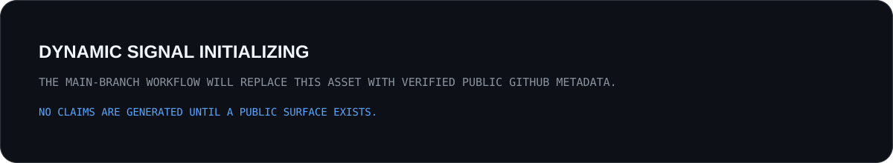

  

  <a href="https://trenchclub.vercel.app/">Portfolio</a> ·
  <a href="https://github.com/sapgun">GitHub</a> ·
  <a href="https://x.com/0xSAPGUN">X / Writing</a>

<strong>Web3 & AI Systems Builder</strong> Building and researching systems across Web3 security, DeFi protocols, onchain infrastructure, sovereign AI and developer tooling.

| System | Focus | Public status |
| --- | --- | --- |
| **VESPERA** | Local-first agent runtime, permission boundaries and owned context | Private core · [public product surface](https://github.com/sapgun/vespera-web) |
| **TrustFi** | Web3 trust & security gateway, signing risk and safer onboarding | [MVP prototype](https://github.com/sapgun/TrustFi) |
| **NodeNest** | Modular DePIN / edge infrastructure for blockchain node operations | [Prototype](https://github.com/sapgun/NodeNest_DEPIN) |
| **MCS** | AI-assisted smart-contract security analysis and modular code marketplace | [Prototype](https://github.com/sapgun/modular-code-marketplace) |
| **AI Systems Bottleneck** | Systems research on profiling, local LLM runtimes and bottleneck reasoning | [Published research](https://github.com/sapgun/ai-systems-bottleneck-book) |

> Implemented, prototype, research and planned work are deliberately separated. Architecture claims should be inspectable.

  

  

Portfolio quadrant is a qualitative map of project orientation, not a performance score.

  

  

  

<strong>Direct repository links</strong>

 

- **[TrustFi](https://github.com/sapgun/TrustFi)** — Web3 security, signing risk, trust scoring and safer onboarding.
- **[VESPERA Web](https://github.com/sapgun/vespera-web)** — public product surface for a private-core local-first agent runtime.
- **[NodeNest](https://github.com/sapgun/NodeNest_DEPIN)** — modular edge / DePIN exploration for blockchain node execution.
- **[MCS](https://github.com/sapgun/modular-code-marketplace)** — AI-assisted smart-contract security analysis prototype.
- **[MirWon](https://github.com/sapgun/mirwon-chain)** — KRW StableFi frontend MVP and protocol-architecture direction.
- **[AI Systems Bottleneck](https://github.com/sapgun/ai-systems-bottleneck-book)** — practical systems research and publication.

**Next public labs — planned, not presented as completed work:**

- `defi-protocol-design-lab` — AMM → ERC-4626 vault → lending/liquidation → stablecoin → perpetuals, with specs, invariants, threat models, Foundry tests and Python simulation.
- `onchain-protocol-research` — reproducible protocol teardown, contract maps, privilege/governance timelines, token economics and risk registers.
- `vespera-spec` — public architecture, ADRs, permission model, MCP interfaces, evals and benchmarks while the runtime core remains private.

Research direction: **mechanism → state transition → invariant → attack surface → economic failure mode → reproducible evidence**.

  

<!-- OUTPUT-FEED:START -->
| Signal | Latest public evidence | Date |
| --- | --- | --- |
| **BUILD** | **[ai-systems-bottleneck-book](https://github.com/sapgun/ai-systems-bottleneck-book)** — A practical field guide to reasoning about AI system bottlenecks — resour… | `2026-08-17` |
| **RESEARCH** | **[ai-systems-bottleneck-book](https://github.com/sapgun/ai-systems-bottleneck-book)** — A practical field guide to reasoning about AI system bottlenecks — resour… | `2026-08-17` |
| **RELEASE** | **[AI SYSTEMS — Korean Edition v1.1](https://github.com/sapgun/ai-systems-bottleneck-book/releases/tag/v1.1-ko)** · `v1.1-ko` | `2026-08-16` |
<!-- OUTPUT-FEED:END -->

  

<!-- PUBLIC-ACTIVITY:START -->
_Career-signal repositories only. Generated from public GitHub metadata._

| Public engineering signal | Language | Stars | Latest push |
| --- | --- | ---: | --- |
| **[ai-systems-bottleneck-book](https://github.com/sapgun/ai-systems-bottleneck-book)** | HTML | 0 | `2026-08-17` |
| **[vespera-web](https://github.com/sapgun/vespera-web)** | HTML | 0 | `2026-08-03` |
| **[NodeNest_DEPIN](https://github.com/sapgun/NodeNest_DEPIN)** | TypeScript | 1 | `2026-06-23` |
| **[modular-code-marketplace](https://github.com/sapgun/modular-code-marketplace)** | TypeScript | 0 | `2026-05-28` |
| **[mirwon-chain](https://github.com/sapgun/mirwon-chain)** | TypeScript | 1 | `2026-05-27` |
| **[TrustFi](https://github.com/sapgun/TrustFi)** | TypeScript | 1 | `2026-05-27` |
<!-- PUBLIC-ACTIVITY:END -->

  

The dynamic cards above are intentionally filtered to career-signal repositories. The contribution graph remains the broad public GitHub activity layer.

  
  

  

These widgets are broad SWE signals. The custom project deck and public engineering signal above remain the career-filtered evidence layer.

- Build prototypes that can be inspected, tested and improved.
- Keep **implemented / prototype / research / planned** boundaries explicit.
- Treat permission, trust and security boundaries as product architecture.
- Use AI as a worker inside the system, not as the owner of the workflow.
- Prefer reproducible research over screenshots and unsupported claims.
- Let the profile reflect evidence, not every repository equally.

<strong>Background</strong>

 
My path started in sports science and Taekwondo, moved through AI / deep learning / computer vision, and then into blockchain product engineering. Today I use that systems mindset across Web3, DeFi, security and local-first AI.

<strong>How this profile works</strong>

 
This README is generated as a small developer-profile system: static SVG brand/architecture layers + configured career-signal repositories + GitHub metadata + a dependency-light Python generator + GitHub Actions. Familiar SWE widgets are layered on top as a secondary signal rather than replacing the custom career-evidence system. See <a href="./docs/PROFILE-SYSTEM.md">PROFILE-SYSTEM.md</a>.

 

<strong>Trench Club</strong> · Keep digging. Build what can be verified.

