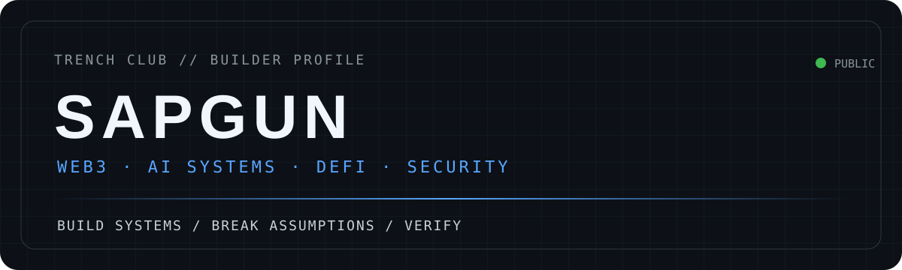
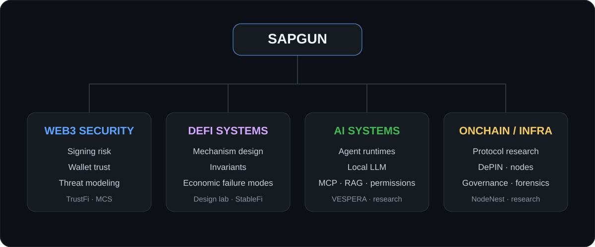
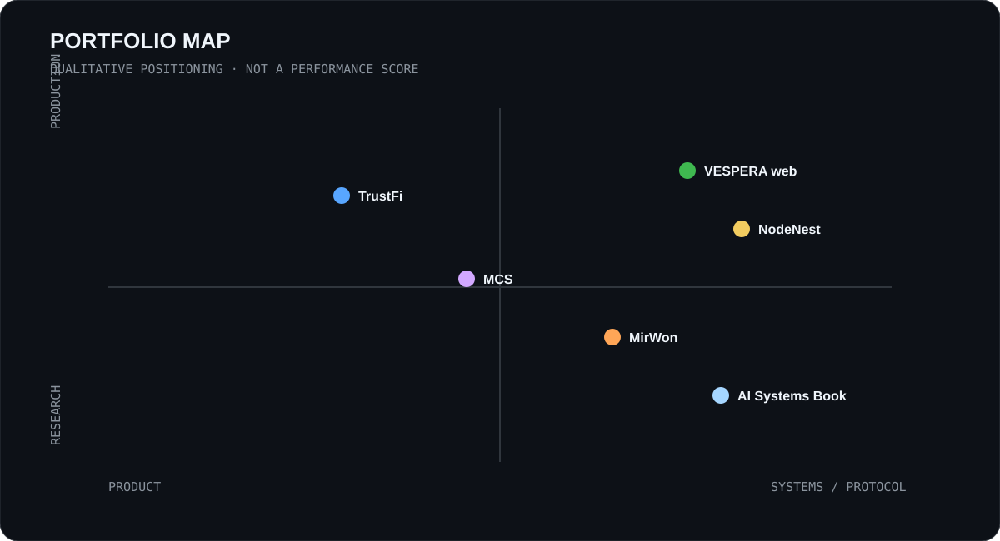
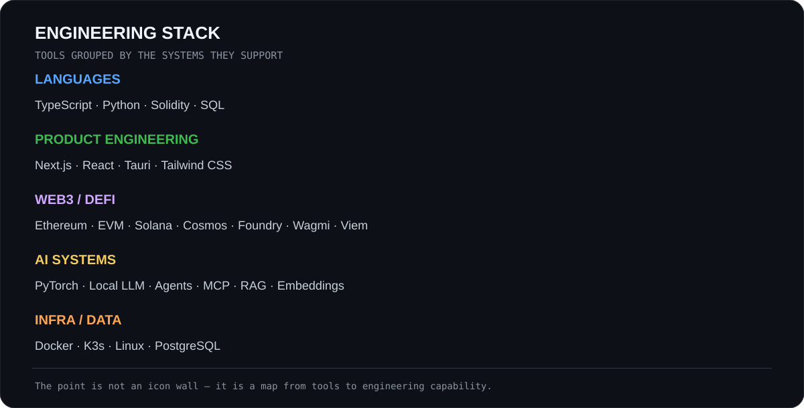
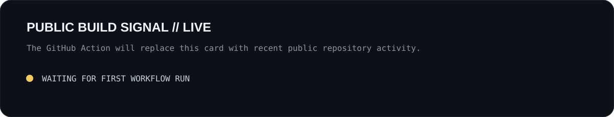

  

  <a href="https://trenchclub.vercel.app/">Portfolio</a> ·
  <a href="https://github.com/sapgun">GitHub</a> ·
  <a href="https://x.com/0xSAPGUN">X / Writing</a>

<strong>Web3 & AI Systems Builder</strong> Building and researching systems across Web3 security, DeFi protocols, onchain infrastructure, sovereign AI and developer tooling.

| System | Focus | Public status |
| --- | --- | --- |
| **VESPERA** | Local-first agent runtime, permission boundaries and owned context | Private core · [public product surface](https://github.com/sapgun/vespera-web) |
| **TrustFi** | Web3 trust & security gateway, signing risk and safer onboarding | [MVP prototype](https://github.com/sapgun/TrustFi) |
| **NodeNest** | Modular DePIN / edge infrastructure for blockchain node operations | [Prototype](https://github.com/sapgun/NodeNest_DEPIN) |
| **MCS** | AI-assisted smart-contract security analysis and modular code marketplace | [Prototype](https://github.com/sapgun/modular-code-marketplace) |
| **AI Systems Bottleneck** | Systems research on profiling, local LLM runtimes and bottleneck reasoning | [Published research](https://github.com/sapgun/ai-systems-bottleneck-book) |

> I separate what is implemented, prototyped, researched and planned. Architecture claims should be inspectable.

  

  

Portfolio quadrant is a qualitative map of project orientation, not a performance score.

  

### Web3 security
- **[TrustFi](https://github.com/sapgun/TrustFi)** — transaction review, signing-risk signals, trust scoring and safer Web3 onboarding.
- **[MCS](https://github.com/sapgun/modular-code-marketplace)** — prototype combining smart-contract security analysis with code-oriented product workflows.

### Systems & infrastructure
- **[VESPERA Web](https://github.com/sapgun/vespera-web)** — public surface for a private-core, local-first agent runtime.
- **[NodeNest](https://github.com/sapgun/NodeNest_DEPIN)** — modular edge / DePIN exploration for blockchain node execution.

### Research & protocol design
- **[AI Systems Bottleneck](https://github.com/sapgun/ai-systems-bottleneck-book)** — practical systems research and publication.
- **[MirWon](https://github.com/sapgun/mirwon-chain)** — KRW StableFi frontend MVP and protocol-architecture direction; chain implementation is not claimed in the current repository.

**Next public labs — explicitly planned, not yet presented as completed work:**

- `defi-protocol-design-lab` — AMM → ERC-4626 vault → lending/liquidation → stablecoin → perpetuals, with specs, invariants, threat models, Foundry tests and Python simulation.
- `onchain-protocol-research` — reproducible protocol teardown, contract maps, privilege/governance timelines, token economics and risk registers.

Research direction: **mechanism → state transition → invariant → attack surface → economic failure mode → reproducible evidence**.

  

<!-- PUBLIC-ACTIVITY:START -->
_This block is generated automatically from public GitHub repository metadata after the workflow is first run._
<!-- PUBLIC-ACTIVITY:END -->

  

- Build prototypes that can be inspected, tested and improved.
- Keep **implemented / prototype / research / planned** boundaries explicit.
- Treat permission, trust and security boundaries as product architecture.
- Use AI as a worker inside the system, not as the owner of the workflow.
- Prefer reproducible research over screenshots and unsupported claims.

<strong>Background</strong>

 
My path started in sports science and Taekwondo, moved through AI / deep learning / computer vision, and then into blockchain product engineering. Today I use that systems mindset across Web3, DeFi, security and local-first AI.

 

<strong>Trench Club</strong> · Keep digging. Build what can be verified.

